# Auto-Sec Architecture Review — does it scale, where are the gaps, and how do Wiz / Orca / Aikido do it?

> **Status:** Review v1.1 (living document) · **Date:** 2026-08-09
> **Basis:** Read-only review (no code changes). Grounded in a full code trace of the scan spine +
> findings SSOT + event pipeline, the architecture skill + ADRs 0004/0006/0008/0010/0016/0021, the
> 2026-08-08 scanner-architecture audit and teams/boards findings, and two cited web-research passes
> (Wiz/Orca/OCSF; Aikido/pipeline-patterns/Postgres-at-scale).
>
> **v1.1 (2026-08-09, at filing):** several current-state claims were written while the work that
> closed them was still merging. Every claim below was re-verified against `origin/main` at
> `4a310ba` before filing; corrections are marked **CLOSED** inline with their PR numbers rather
> than deleted — the history of a gap is as useful as the gap. See §10 for the full correction log.
>
> This is a snapshot; it will drift from the code. Re-ground before building on any specific claim.

---

## 0. TL;DR verdict

**Your mental model is ~90% correct, and the architecture you have is the one the industry
converges on.** Ports + registries + one normalized Finding SSOT + a derived graph + agents on top
is literally the DefectDojo / secureCodeBox / Orca-unified-model shape, and OCSF — which Prowler
already emits and the spine already aligns to — is now the industry's normalization standard
(Linux Foundation, ITU ratification track, AWS Security Hub emits it natively).

The four decisive answers you asked for:

1. **Staging bucket for raw scan output — YES, build it, but as a narrow "scan-output artifact
   channel," not a data lake.** Today raw output rides pod-log stdout into worker memory and is
   discarded; kubelet log rotation silently truncates at ~10Mi and the parser then "defensively
   yields zero findings" — a **silent false-negative**, the worst failure mode a security scanner
   can have. Your own code already names the fix (`prowler_scanner.py` docstring; ADR 0006 D4
   follow-up). ~2-3 days, reuses the existing MinIO seam. **This is now the single biggest gap
   (see §5) — it inherited the top slot when the Prowler-on-spine migration landed.**
2. **NoSQL for findings — NO.** The findings workload is OLTP-shaped (unique-constraint dedupe,
   mutable lifecycle, tenant-scoped filtered reads, joins to tags/tasks/risk/runs, transactional
   event emission). GitLab runs its entire vulnerability-management product on Postgres;
   DefectDojo is literally Django + Postgres + Celery. The 9k-card incident was an **unpaginated
   read path** (10.8MB / 33s board serialization), not a storage-engine problem. Flip criteria
   are named in §6.2 — none are near.
3. **Does it scale to many more input types — YES**, the seam is proven 5× (ScannerPort,
   LogSourcePort, VcsPort, DeliveryChannel, PostureProvider). What actually drifts at N inputs is
   the hand-maintained registration lists — and that fix has now landed as fitness tests (§5, G7).
4. **The remaining "finish the design" work is small and named.** The item that held this slot in
   v1.0 — *"Prowler, the flagship pillar, still bypasses the spine"* — **CLOSED on 2026-08-09**
   (PRs #283, #287, #284, #291). Prowler now rides the same spine as every engine: registry entry,
   ScanRun provenance, cooldown gate, FAILED rows, audit trail, and the forbidden per-pillar
   finding tables are deleted. What is left is §8's short list, led by the artifact channel.

Nothing here recommends re-platforming. The "at scale" items (§8) are deliberately deferred with
named triggers, per the customer-driven direction (Tom/Isaac first).

---

## 1. Your mental model, piece by piece (confirm / correct)

| Your model | Verdict | Reality (evidence) |
|---|---|---|
| 3 input classes: VCS, logs, infrastructure | **Confirmed, plus two you didn't count** | VCS (GitHub via `VcsConnection`+`repo_allowlist`, ADR 0010; GitLab/Bitbucket planned), logs (S3 + CloudWatch adapters behind `LogSourcePort`, ADR 0008, per-workspace `WorkspaceLogSource`, cursor checkpoints), infrastructure (AWS via AssumeRole; **Vercel now BUILT and flag-gated** — ADR 0021 shipped, see the correction below; GCP/Azure aspirational). Also real inputs today: **container images** (validated, allowlisted refs → Trivy) and **vuln-intel feeds** (EPSS/KEV → `FindingRisk`). "Infrastructure, not AWS" is the right framing and ADR 0021's `PostureProvider` is exactly that axis. |
| Scanning = k8s Jobs behind `ScanExecutionBackend`, Django orchestrates | **Confirmed — and the asterisk is now gone** | `ScannerPort` (shared kernel) + `ScanExecutionBackend` port → `K8sJobBackend` renders one ephemeral hardened Job per scan (non-root, RO rootfs, drop-ALL caps, seccomp, gVisor class, ephemeral-storage caps, default-deny egress, cred Secret deleted after). Celery beat + scan-now dispatch through one registry + cooldown gate. ~~**Asterisk: Prowler — the pillar customers will actually use — never migrated onto this spine.**~~ **CLOSED 2026-08-09** (#287/#291): `scanner_registry` now carries `cloud_posture.prowler` (+ a `cloud_posture.prowler.vercel` sibling) with post-ingest and failure hooks; Trivy, Opengrep and Prowler all ride the spine cleanly. |
| Raw dumps → staging bucket → analyze → store? | **Right instinct; not built; build the narrow version** | Today: Job writes to stdout (Prowler `cat`s its OCSF file to stdout because it has no stdout mode) → backend reads pod logs once into a Python string → adapter parses in the trusted worker → raw discarded. §6.1 has the full answer. **Re-verified 2026-08-09: still open** — `k8s_job_backend.py` still transports raw output via `read_namespaced_pod_log`, and `components/scanning` has no artifact-store seam. |
| Findings in NoSQL "for speed" | **Wrong instinct — keep Postgres** | §6.2. The read-path problem you saw was real but was a pagination/retention bug, verified: the board columns endpoint serialized all 9,053 cards (10.8MB/33s, client gives up). `performance.md` §11 violation, not a DB limit. **The pagination half CLOSED 2026-08-09** (#302). |
| ECS Fargate for scan jobs | **Parked, correctly** | Prior research stands: an escape-valve implementation behind `ScanExecutionBackend` if k8s capacity becomes the constraint. Nothing to do now; the port makes it a later adapter, not a decision. |
| Read-only everywhere; write only for VCS draft-PR | **Honored, with one named exception to keep explicit** | AWS: customer-side role with `ViewOnlyAccess`/`SecurityAudit` + ExternalId (confused-deputy protection), STS AssumeRole vended per-run; logs: same read-only role; Vercel: read-only Viewer token, vended through the registry's `credentials_factory` seam; VCS: write used **only** by `open_draft_pr` (never merges; PAT today — ADR 0010's GitHub-App short-lived repo-scoped tokens are the right productized end-state). **Exception:** `components/response` (reversible SOC actions) is propose→approve→execute with boto3 `DryRun` default — real execution will someday need write scopes. Keep that as a separate, explicitly-consented role add-on, never folded into the audit role. |
| Outputs: Slack (digested), HUD, board provenance; draft PR is the bridge | **Confirmed, all built** | Slack delivery is live (`slack_delivery_adapter` + `external_delivery_tasks`, one digest per completed scan via `ScanCompleted` — the ADR 0016 D5 anti-flood design); HUD reads materialized CQRS rows; every finding becomes a board Task via one handler; the draft-PR loop is proven end-to-end with full provenance stamping. |

### 1.1 Your `auto-sec-architecture.mermaid` sketch — the three corrections

You suspected the Agent box was off. Correct, plus two more:

1. **The "Agent behavior monitor" wedge conflates two things.** Provenance/audit of **our own
   agents** is BUILT and is a strength (agent service principal SEE-201, per-call `DeepRunLog` +
   Langfuse, `AIAction` rows, sign_off gates, the board-provenance HARD rule) — the article-mapping
   doc calls it "our strongest overlap, already product." Monitoring the **customer's** agents
   (Isaac's ~60: "what did MY agents do, under what identity") is the genuinely unbuilt bet.
   **There is no ADR for it** — it is deliberately written-down-not-built in
   `docs/plans/AI_SECURITY_ARTICLE_MAPPING_2026-08-08.md` (Adopt #2),
   `docs/competitive/LANDSCAPE_2026-08.md` ("write it down, do not build it yet"), and the posture
   vision §3.4 (AI-SPM). When you decide to build it, that's the moment it gets an ADR.
2. **The S3 "RAW LANDING ZONE" is drawn as existing — it does not exist.** It is exactly the §6.1
   recommendation.
3. **Log detectors don't (and shouldn't) stage raw logs to S3.** They read windows FROM the
   customer's sink with checkpoints and emit findings; the customer's bucket IS the raw store.
   Also `INFRA → Trivy` is wrong (Trivy scans image refs, not the cloud connection), and
   GitLab/GCP/Azure are planned, not built.

---

## 2. The real data flow today (hop by hop, with sizes and limits)

```
connection (read-only creds)
  → Celery dispatch_scan [beat or scan-now]  (gate: cooldown + single-in-flight via ScanRun history
      + cache lock — covers code_security, cloud_posture AWS, cloud_posture Vercel; see G4 for the
      paths still ungated)
  → scanner_registry.get(source) → ScannerPort adapter builds fixed argv
  → ScanExecutionBackend.run(ScanJobSpec)
      K8sJobBackend: short-lived cred Secret → hardened Job (2Gi default mem limit, 4Gi ephemeral,
      activeDeadline, gVisor when set) → poll → read pod logs ONCE (raw bytes) → delete Secret/Job
  → ScanJobResult.stdout  ←— THE FRAGILE HOP: full raw output as ONE in-memory string,
      transported via kubelet pod logs (rotation default ~10Mi → silent truncation;
      trivy-operator hit exactly this; Prowler full-account OCSF is multi-MB and growing)
  → adapter parses stdout → ScanResult(findings=[NormalizedFinding...])  (raw is then DISCARDED —
      no replay, no re-normalization, no debugging artifact, no audit copy)
  → run_scan_and_ingest: ScanRun row finalized in a transaction (status/engine_version/counts,
      FAILED rows on failure, lifecycle mirrored into the immutable audit trail); after commit emits
      one FindingObserved PER FINDING + one ScanCompleted (Celery task per event per subscriber)
  → findings context: RecordObservedFindingUseCase — upsert on (workspace, source, fingerprint);
      new/changed/reopened → FindingRaised; steady-state re-observation → last_seen bump, NO event
      (the noise suppressor); provisional risk stamped inline, EPSS/KEV/exposure rescored async
  → consumers: board handler → Task card (+ triage dispatch); Slack digest (ScanCompleted);
      materialized FindingRisk / ATT&CK / attack-path tables → HUD single-SELECT reads
```

Side pipelines (correctly NOT on the scan spine): `cloud_graph` boto3 inventory → Asset graph +
attack paths (Postgres recursive CTE, background-materialized); `logwatch` deterministic detectors
over log windows (no LLM on the raw firehose — prompt-injection posture, reaffirmed by ADR 0021's
rejection of Vercel drains); SBOM by-product → MinIO via `on_completed` post-ingest hook.

**Where it breaks at 10×:** (a) the pod-log hop truncates on big accounts → parser yields fewer/zero
findings with a COMPLETED run — invisible; (b) whole-output-in-RAM in the worker; (c) a 5k-finding
account scan fans out 5k+ Celery tasks per subscriber in one burst (tolerable now — queue pinning
exists — but unmetered); (d) the board read path fell over at 9k cards — **now windowed (#302)**,
but without a retention policy the underlying card count still grows unbounded.

---

## 3. What's genuinely good (seams that match industry practice)

1. **`ScannerPort` + `ScanExecutionBackend` split** — identical in shape to OWASP secureCodeBox
   (generic K8s-Jobs engine + per-scanner container + per-scanner parser). Ephemeral hardened
   per-scan Jobs are *stronger* isolation than anything Aikido publicly discloses.
2. **OCSF-aligned `NormalizedFinding`** — you bet on the standard the industry then converged on:
   OCSF joined the Linux Foundation (Nov 2024), is on an ITU ratification track (mid-2026), AWS
   Security Hub now emits it natively, and Prowler's `json-ocsf` is its default output. Your
   normalize-once seam is exactly the AWS Security Lake custom-source pattern.
3. **One Finding SSOT with fingerprint dedupe + lifecycle** — the DefectDojo (`hash_code`) and
   GitLab (`vulnerability_occurrences` fingerprint) pattern; your steady-state "re-observation bumps
   last_seen, emits nothing" is the anti-alert-fatigue behavior Aikido markets as AutoTriage step 1.
4. **Run provenance now reaches the finding** — `FindingObserved.scan_run_id` + the indexed
   `Finding.scan_run_id` column landed (the 08-08 audit's R2 is DONE, #284); finding → run →
   trigger/user/engine-version is a join. This is SARIF's `run`/`invocation` model, and it's the
   substrate for ADR 0009's "provenance is the product."
5. **Owner-persists via events + read-ports** — scanning never writes findings; the board Task is a
   local copy; correlation is by `AssetUrn` value, not FK. This is what will keep pillar #10 from
   being a rewrite.
6. **Materialized read models** (FindingRisk, ATT&CK coverage, attack paths) — the "graph is a
   derived read model, not the system of record" lesson both Wiz (Neptune beside Aurora) and Orca
   (Neptune beside a findings DB + Iceberg lake) embody.
7. **Anti-flood outbound design** — one `ScanCompleted` digest per run through one delivery funnel
   with a truthful per-channel ledger. William's "digest, not a wall" is structurally encoded.
8. **The permission posture** — read-only roles + ExternalId + short-lived vended creds + a single
   write scope gated behind human approval is textbook, and better than the market norm (Orca's
   brief asks for block-storage read; you ask for less).
9. **One generic `ScanRun` table, and the per-pillar clones are gone** *(new in v1.1)* — the
   `cloud_posture` migration didn't just add a registry entry, it **deleted**
   `CloudPostureScan`/`CloudPostureFinding` and data-migrated their history into `ScanRun` (#291).
   The ADR 0004 C6 violation is not deprecated-in-place, it is removed — the strongest possible
   version of that fix, and the precedent every future pillar now inherits.

---

## 4. How the comparables actually do it (cited highlights)

**Wiz.** Security Graph on **Amazon Neptune** (Gremlin), "hundreds of billions of relationships" —
but the graph sits BESIDE **Aurora PostgreSQL**, which stores the resource records. Ingest:
scheduled Cloud Scanner → SNS/SQS → ingestors → Aurora, with **ElastiCache Redis set-diffing so
~90% of unchanged resources per scan skip DB writes** (their biggest published cost/perf win —
note it's a *dedupe-before-write* optimization, the same class as your steady-state no-emit).
Agentless = cloud snapshot APIs, disks mounted read-only in ephemeral scanners in-region. Pricing:
per-workload (~$6-30/workload/yr; ingest-based only for the Defend/log module).
(Sources: AWS Database Blog "The world is a graph"; AWS/Wiz ElastiCache engineering post; re:Invent
DAT302; wiz.io/pricing + third-party trackers.)

**Orca.** Patented SideScanning: one-time read-only IAM role, block-storage snapshots analyzed by
ephemeral Spot instances, **only metadata leaves the account**. Unified Data Model normalizes all
sources into "a single holistic database"; the connectivity/exposure graph is **Neptune with
per-tenant Gremlin `PartitionStrategy`** (the one public multi-tenant graph pattern — even at
Orca's scale the graph is shared + partitioned, not per-tenant clusters); analytics moved to a
**petabyte S3 + Iceberg lake fed by Kafka/MSK** — the closest public "raw to object storage before
normalization" reference. Pricing: per-workload, deliberately not ingest-based.
(Sources: Orca SideScanning technical brief; AWS Database Blog Neptune-optimization post; AWS Big
Data Blog Iceberg post; orca.security pricing blog.)

**Aikido — your closest analog.** Wraps the same OSS engines you do (Trivy, Checkov, ZAP, Nuclei,
Opengrep — they led the Semgrep fork, Syft/Grype, Gitleaks, CloudSploit) behind one product;
AutoTriage = cross-scanner dedupe → reachability filter → LLM false-positive pass (~95% noise-cut
claim). Their internal stack/data model is NOT public — no engineering blog on their runtime; they
market "not merely a wrapper" (proprietary glue + custom rules). Pricing: **flat platform fee**
(Free 2-user → $350/$700/$1,050/mo incl. 10 users), explicitly anti-per-seat.
(Sources: aikido.dev build-vs-buy + open-source pages; help.aikido.dev AutoTriage/reachability
docs; codeant.ai/xpay pricing teardowns.)

**Pattern synthesis:** every mature multi-scanner platform lands on your shape — per-tool
integration units feeding one normalized findings store, a derived graph/context layer, and
noise-reduction as the headline value. The deltas between you and the leaders are (a) they stage
raw/derived data in object storage for replay + analytics, (b) they diff before writing, and
(c) their graph is a dedicated store only at a scale you are 4-5 orders of magnitude away from.

---

## 5. Gaps, ranked by when they bite

**Bites Tom/Isaac (now):**

| # | Gap | Why it matters | Fix / effort |
|---|---|---|---|
| **G3** | **Raw-output transport** ← **now the #1 gap** | Silent truncation → false-negative scans on exactly the biggest (most valuable) accounts. The one bug class a security product cannot have, and it gets *worse* now that Prowler full-account OCSF rides the same hop | §6.1 artifact channel; ~2-3 days |
| G2 | Board read path — **pagination half CLOSED** (#302) | Was: the AI-findings board serialized 9,053 cards → 10.8MB/33s → a hard 504. Now every lane is windowed (default 50, clamped 200) with `tasks_total`/`tasks_has_more`, plus `GET /project/columns/<id>/tasks/?offset&limit` to page the remainder | **Remaining:** the retention half — auto-archive stale Suggested cards so the count stops growing. The SSOT stays complete |
| G4 | Gate coverage + audit trail (audit R3/R4) — **audit half CLOSED** (#287) | Scan-run lifecycle now writes one immutable `EntityAuditLog` row per transition via `scan_run_audit_adapter` (entity `scanning.scanrun`, actor resolved from `triggered_by_id`) | **Remaining:** the gate still doesn't cover every trigger path — `container-security-scan` scan-now dispatches ungated (it does stamp `triggered_by`), as do the `scan_repo` / `scan_image` CLI commands. ~1 day |
| ~~G1~~ | ~~**Prowler off the spine** (audit R1)~~ | **CLOSED 2026-08-09** — see the box below | — |

> **G1 — CLOSED 2026-08-09 (PRs #283, #287, #284, #291).** Kept here because the shape of the gap is
> the reusable lesson: a flagship pillar that "works" off the spine accumulates its own tables, its
> own task module, its own timestamps, and silently opts out of every cross-cutting guarantee the
> spine provides. Verified in code at `4a310ba`:
> - **Registry** — `components/scanning/application/providers/scanner_registry.py` carries
>   `cloud_posture.prowler` (queue `cloud_posture`, post-ingest + failure hooks) and a
>   `cloud_posture.prowler.vercel` sibling resolving the ADR 0021 `PostureProvider`.
> - **Provenance** — `ScanRun` carries `trigger`, `triggered_by_id`, `engine`, `engine_version`,
>   and a real `FAILED` status; scan history is per-run, not fabricated (#284 carried
>   `scan_run_id` across the event boundary into the SSOT).
> - **Gating** — the cooldown + single-in-flight gate is live for the pillar and honestly returns
>   **429** when every account is gated (`test_second_scan_now_is_gated_with_429`); a failed run
>   does *not* start a cooldown.
> - **Audit** — `components/scanning/infrastructure/adapters/scan_run_audit_adapter.py` mirrors
>   every lifecycle transition into the shared immutable trail (audit R4).
> - **The forbidden tables are gone** — migration
>   `cloud_posture/0002_migrate_scans_to_scanrun_delete_legacy.py` data-migrates every
>   `CloudPostureScan` row into `ScanRun`, then `DeleteModel`s `CloudPostureFinding` and
>   `CloudPostureScan` (#291). The ADR 0004 C6 violation is removed, not deprecated.
>
> Two v1.0 statements this invalidates: "the Vercel P0 gate contract structurally cannot work until
> this lands" (it landed, and Vercel posture shipped on top of it), and "Prowler ⚠ off-spine" in the
> §11 diagram (corrected).

**Bites at the first ~10 customers:**

| # | Gap | Why | Fix |
|---|---|---|---|
| G5 | **Event-burst backpressure** | One Celery task per finding per subscriber: a 5k-finding first scan = 15k+ tasks in one burst; workers shared with other tenants' latency | Chunked emission (batch `FindingObserved` per N findings or a per-run batch event unpacked by the findings worker) + per-queue rate limits; measure first — the seam (one publisher) makes this a localized change |
| G6 | **Ingest cost controls** (William) | Nothing meters scan frequency/volume per workspace; billing recommendation (meter on connected estate) needs enforcement points | Entitlement checks at the gate + per-workspace schedule config; pairs with G4's remaining gate work |
| ~~G7~~ | ~~12 hand-lists drift (audit R5)~~ | **CLOSED 2026-08-09 (#283).** `tests/test_scanner_registration_fitness.py` asserts every registry source has a `_SOURCE_BOARD` mapping, every registry queue has a deployed consumer, `DISPATCH_PINNED_QUEUES` *equals* the registry's queue set, and per-env beat-schedule presence matches an explicit decided matrix — so the next change is a conscious edit, not drift. It caught a third live drift (the Vercel entry) during its own review | — |
| G8 | **Per-pillar shell duplication** | ~11 near-identical files per pillar; tax at N=10 | Converge at the 4th ENGINE pillar (named trigger), not now |

**At scale (named triggers, not now):**

| # | Gap | Trigger | Answer |
|---|---|---|---|
| G9 | Findings analytics/history volume | Dashboard-style aggregations over long ranges get slow despite materialization; or scan-event history in the hundreds of GB | Add a columnar **derived** store (ClickHouse or S3+Iceberg like Orca) fed by the same events; SSOT stays Postgres |
| G10 | Asset-graph store | Attack-path queries need 4-6+ hop / shortest-path semantics as a core product primitive, or edges cross ~10⁷-10⁸ | Only then a graph DB (the documented Neo4j/Neptune win zone); until then Postgres CTE is *faster* for your shallow bounded-depth queries |
| G11 | Multi-cloud inventory | A real GCP/Azure customer | `PostureProvider` already covers posture (Prowler natively scans GCP/Azure/M365) and is now proven twice (AWS + Vercel); the actual work is per-provider `AssetInventoryPort` adapters + keeping URNs provider-prefixed (ADR 0021 already guards this). The seam is ready; don't build ahead of a customer |
| G12 | Tenant sharding / residency | Enterprise data-residency asks | Postgres partitioning by workspace first; cell-based deployment later. Single-DB is correct today |

---

## 6. The two big questions, decisively

### 6.1 Staging bucket: YES — as the scan-output contract, scoped tightly

**Build:** extend `ScanJobSpec`/backends with an **artifact output channel**: the Job writes its
result file to the emptyDir scratch and the backend ships it to object storage (MinIO in-cluster
today — the `minio_sbom_store` seam already exists; S3 in cloud) via presigned PUT or a collector
step; the trusted worker fetches, parses, and the SSOT flow is unchanged. Retain raw artifacts
under a per-workspace prefix with a short TTL (7-30 days) and size caps.

**Why this is the root fix and not gold-plating:**
- Kills the silent-truncation false-negative (G3) — the one bug class a security product cannot
  have. Your own adapter docstring and ADR 0006 D4 already prescribe exactly this.
- Replay/re-normalization: a parser bug or a new normalizer version can re-ingest yesterday's scan
  without re-hitting the customer's cloud (rescan = API load + cost + trust).
- Debugging + support: "why did this scan find nothing" becomes inspectable.
- Audit/compliance evidence (ADR 0009): the raw engine output IS the first-party evidence object.
  This now compounds with the scan audit trail that landed in #287 — the trail says a run happened
  and who triggered it; the artifact is the evidence of *what it saw*.
- Industry-verified: secureCodeBox persists raw results to S3/MinIO; Orca's lake is the same
  pattern grown up; AWS Security Lake codifies raw→S3→normalize as the reference architecture.

**Explicitly NOT in scope:** no data lake, no Parquet/Iceberg, no ETL framework, no staging for
log ingestion (the customer's sink is the raw store; you read windows with checkpoints), and
normalization stays exactly where it is — in the `ScannerPort` adapter, which is already your
first-class normalize seam (one per source, converging on OCSF). Your "normalize as a layer"
instinct is already satisfied by the current design; it does not need a separate service.

### 6.2 NoSQL for findings: NO — and here is when it would flip

The Finding SSOT's workload profile: upsert-dedupe against a **unique constraint** with
read-modify-write lifecycle logic, mutable triage state, tenant-scoped filtered+ordered reads
(all index-backed), joins to tags/risk/tasks/runs, and **transactional after-commit event
emission**. That is the textbook definition of an OLTP relational workload:

- GitLab runs vulnerability management for gitlab.com on Postgres; their answer to >50-100GiB
  finding tables is **partitioning inside Postgres**, not leaving it.
- DefectDojo — the reference open-source findings platform — is your exact stack (Django +
  Postgres + Celery + Redis) with hash-based dedupe; its documented pains are dedupe
  *configuration*, never Postgres capacity.
- Wiz itself keeps resource records in **Aurora PostgreSQL** — the graph and caches are derived.

What DynamoDB/Mongo would cost you, concretely: fingerprint dedupe demoted from a DB constraint to
application-level conditional writes; the tag/task/risk joins re-implemented as fan-out reads; the
after-commit event contract (no orphan findings) lost; the architecture fitness tests and the
tenant-isolation test suite (cross-tenant isolation locked in #274) re-proven on a second
consistency model; pgvector adjacency lost. "For speed" buys nothing because the slow thing was
never the store — the 9k-card board was an unpaginated serializer (now windowed, #302), and the
findings list already reads via covering indexes + materialized risk rows.

**Honest flip criteria (write them down, revisit at each 10× of tenants):**
1. Sustained finding-upsert throughput beyond a few thousand rows/sec after batching + the
   Wiz-style diff-before-write optimization (skip unchanged fingerprints *before* the upsert — the
   Datadog-documented `ON CONFLICT` lock/WAL cost is the thing to watch) → consider partitioned
   writes first, then a queue-buffered ingest tier.
2. Findings table past ~hundreds of millions of rows with partition pruning exhausted → time-based
   or tenant-hash partitioning (still Postgres).
3. Analytics/history workloads (trend lines over billions of scan events) → ClickHouse/Iceberg as
   a **derived** read model (the documented Reco/Momentic flip was analytics volume, never CRUD).
4. Search/faceting product needs (free-text across titles/descriptions at scale) → OpenSearch as a
   projection. In every case the SSOT stays Postgres; you add read models, you don't move the truth.

### 6.3 Fargate (per your "don't dwell")

Standing answer unchanged: a second `ScanExecutionBackend` adapter if k8s node capacity ever
constrains scan bursts. The port means this is an implementation afternoon-decision later, not an
architecture decision now.

---

## 7. Where your instincts are right vs where they'd add complexity without payoff

**Right:** infrastructure-not-AWS framing (PostureProvider — now proven twice, AWS + Vercel);
staging the raw scan output; treating Django as orchestrator with the untrusted work in throwaway
Jobs; read-only-except-draft-PR as the trust story (it is a *sales* asset — lead with it); "many
more inputs are coming" (the seam is ready; the generic SARIF/OCSF ingest endpoint is the ~2-3-day
answer when a customer brings their own scanner).

**Would add complexity without payoff (today):** NoSQL findings store; a graph database; staging
for log ingestion; a meta-framework for pillar registration (fitness tests suffice — and now
exist); building GCP/Azure inventory before a customer exists; any Kafka-shaped event backbone
while Celery+Redis carries the volume (swap the broker later if ever needed — the publisher is one
class).

---

## 8. What to actually change, phased

**Now (finish-the-design work, ~1 week remaining, all prescribed by existing ADRs/audits):**

1. **Raw-output artifact channel to MinIO/S3 with TTL (G3 / §6.1)** — the top item. ~2-3 days.
2. **Suggested-card retention / auto-archive (G2 remainder)** — #302 made the board readable; this
   stops the card count growing without bound. The SSOT stays complete.
3. **Gate the remaining trigger paths (G4 remainder)** — `container-security-scan` scan-now and the
   two CLI commands + CLI actor stamping. ~1 day.

*Completed since v1.0 and struck from this list:* Prowler onto the spine (was #1 — #287/#291),
scan-run audit trail (#287), `scan_run_id` across the event boundary (#284), registration fitness
tests (#283), board lane windowing + per-lane load-more (#302).

**At the first ~10 customers:**

4. Chunked/batched finding-event emission + per-queue rate limits (G5) — measure, then change the
   one publisher.
5. Entitlement-backed scan frequency/estate metering at the gate (G6 — William's cost control,
   aligns with the pricing recommendation).
6. Converge the pillar shell at the 4th engine pillar (G8).
7. GitHub App auth for the draft-PR write path (short-lived, repo-scoped, PRs authored by the app).

**At scale (trigger-gated, revisit quarterly):**

8. Columnar derived store for analytics/history (G9) — only when materialized tables stop being
   enough.
9. Graph DB (G10) — only if deep-traversal attack-path becomes the core primitive at 10⁷+ edges.
10. Per-provider inventory adapters as customers arrive (G11); tenant partitioning/cells (G12).

---

## 9. Sources

In-repo: `.claude/skills/architecture/SKILL.md`; ADR 0004/0006/0008/0010/0016/0019/0021;
`components/scanning/*` (k8s_job_backend, run_scan_service, scan_gate, scanner_registry,
scan_run_audit_adapter); `infrastructure/persistence/scanning/models.py`;
`infrastructure/persistence/findings/models.py`; `infrastructure/persistence/cloud_posture/
migrations/0002_migrate_scans_to_scanrun_delete_legacy.py`; `record_observed_finding_use_case.py`;
`prowler_scanner.py`; `celery_event_publisher.py`; `tests/test_scanner_registration_fitness.py`;
the 2026-08-08 `scanner-architecture-audit.md` + `teams-boards-findings-2026-08-09.md` (session
artifacts); `docs/plans/AI_SECURITY_ARTICLE_MAPPING_2026-08-08.md`;
`docs/competitive/LANDSCAPE_2026-08.md`.

External (key): AWS Database Blog — Wiz/Neptune "The world is a graph"; AWS — Wiz/ElastiCache
ingestion post; Orca SideScanning Technical Brief; AWS Database Blog — Orca Neptune optimization
(PartitionStrategy multi-tenancy); AWS Big Data Blog — Orca petabyte Iceberg lake; Aikido
build-vs-buy + AutoTriage/reachability docs + Opengrep retrospective; OCSF: Linux Foundation
announcement, ITU ratification (AWS Open Source Blog), Prowler `json-ocsf` docs; GitLab security
report ingestion + partitioning issue #427973; DefectDojo dedupe docs; Datadog Postgres upsert
engineering post; ClickHouse Reco migration; secureCodeBox v2 architecture; Harness STO Custom
Ingest; Evokoa/PuppyGraph Postgres-vs-graph benchmarks. (Full URLs in the two research reports;
the load-bearing claims above are each tied to one of these.)

---

## 10. Correction log (v1.0 → v1.1, at filing)

The review was written on 2026-08-09 while several PRs were merging the same day. Every
current-state claim was re-verified against `origin/main` at `4a310ba` before filing. Corrections:

| # | v1.0 claim | Correction | Evidence |
|---|---|---|---|
| 1 | "Prowler still bypasses the spine — no ScanRun, no gate, no triggered_by, the forbidden per-pillar table" — named the **single biggest gap** (§0.4, §1, §5 G1, §8.1) | **CLOSED 2026-08-09.** Marked closed in place, not deleted; §5 now carries the full closure box | PRs #283/#287/#284/#291; `scanner_registry.py`, `ScanRun` model, `scan_run_audit_adapter.py`, migration `0002_migrate_scans_to_scanrun_delete_legacy.py` |
| 2 | Top-priority gap ranking | **Re-ranked:** G3 (raw-output artifact channel / silent ~10Mi truncation false-negative) is now #1 — the review's own next-ranked item | §5, §8; `k8s_job_backend.py` still uses `read_namespaced_pod_log`, no artifact seam in `components/scanning` |
| 3 | "Vercel = ADR 0021 design-only" (§1 table); "the Vercel P0 gate contract structurally cannot work until [Prowler-on-spine] lands" (§5 G1) | **Vercel posture is BUILT and flag-gated** — it shipped *on top of* the spine migration | `cloud_posture.prowler.vercel` registry entry, `trigger_vercel_scan_use_case.py`, `vercel_posture_tasks.py` beat schedule, PR #294 |
| 4 | G2 board read path: "serializes 9,053 cards → 10.8MB/33s → unusable" | **Pagination half CLOSED (#302)** — every lane windowed (default 50, clamp 200) with `tasks_total`/`tasks_has_more` + `GET /project/columns/<id>/tasks/?offset&limit`. The retention/auto-archive half remains open | PR #302 |
| 5 | G7 "12 hand-lists drift — the fix is fitness tests (specced as R5)" | **CLOSED (#283)** — the fitness tests exist and already caught a third live drift | `tests/test_scanner_registration_fitness.py` (4 assertions) |
| 6 | G4 "zero audit-context writes for scans" | **Audit half CLOSED (#287)**; the gate-coverage half is narrowed to a named list rather than "5 of 6 paths" | `scan_run_audit_adapter.py`; `container-security-scan` + `scan_repo`/`scan_image` CLI still ungated |
| 7 | §0.3 "the seam is proven 4× … PostureProvider is becoming the 5th" | **Proven 5×** — PostureProvider is live, not becoming | Registry carries two posture providers |
| 8 | §2 flow: "gate … Trivy/Opengrep only today" | Gate now covers code_security + cloud_posture AWS + cloud_posture Vercel; ungated paths named explicitly | `scan_dispatch_service.py`, `trigger_vercel_scan_use_case.py`, `trigger_repo_scan_use_case.py` |
| 9 | §11 diagram: `Prowler (⚠ off-spine today)`, `Vercel planned ADR 0021` | Both corrected in the embedded diagram source | §11 |

Claims re-verified as **still accurate** (no change): the raw-output/truncation gap (G3); the
read-only permission posture including the single `open_draft_pr` write scope and the
`components/response` DryRun exception; `FindingObserved.scan_run_id` (audit R2 DONE, #284); the
event-per-finding fan-out (G5); one `ScanCompleted` Slack digest per run; the `AssetUrn`-by-value
correlation; and all of §4 and §6.2 (external research, unaffected by this repo's merges).

---

## 11. Current-state diagram

Source of truth for the picture below is the fenced block itself — GitHub renders it natively, and
the same text pastes straight into Excalidraw via its **"Mermaid to Excalidraw"** importer
(excalidraw.com). Kept as text rather than a committed PNG so it stays diffable and regenerable;
`docs/` carries no binary images.

Legend: green = the SSOT you must not fragment · red = the fragile hop and the one write edge ·
dashed = planned / async.

```mermaid
%% Auto-Sec — current-state architecture (2026-08-09, v1.1), grounded in code at origin/main 4a310ba.
%% green = read-only edge · red = the ONLY write edge · dashed = planned/async.
flowchart LR
  subgraph INPUTS["INPUTS — customer estate (read-only)"]
    VCS["GitHub repos (VCS)<br/>GitLab/Bitbucket planned ADR 0010"]
    INFRA["AWS accounts + Vercel (ADR 0021, built + flag-gated)<br/>GCP/Azure aspirational"]
    LOGS["Log sinks: S3 / CloudWatch<br/>LogSourcePort, ADR 0008"]
    IMG["Container images<br/>validated + allowlisted refs"]
    FEEDS["Vuln intel: EPSS / CISA KEV"]
  end
  subgraph CONN["CONNECTIONS — integrations context"]
    CVCS["VcsConnection + repo_allowlist<br/>read: tarball at SHA"]
    CAWS["AssumeRole + ExternalId<br/>ViewOnly / SecurityAudit (read-only)"]
    CLOG["WorkspaceLogSource<br/>cursor checkpoints (read-only)"]
  end
  subgraph SPINE["SCAN SPINE — components/scanning"]
    DISP["Celery dispatch_scan<br/>beat + scan-now · gate + registry"]
    ADPT["ScannerPort adapters<br/>Prowler (AWS + Vercel) · Trivy · Opengrep — ALL on-spine"]
    JOB["ScanExecutionBackend<br/>ephemeral hardened K8s Job (gVisor)"]
    RAW["raw output = pod-log stdout<br/>⚠ truncates ~10Mi → silent 0 findings (TOP GAP)"]
    NORM["parse + normalize<br/>NormalizedFinding (OCSF-aligned)"]
    RUN[("ScanRun — ONE table, every pillar<br/>trigger · triggered_by · engine_version · FAILED rows")]
    AUD["scan_run_audit_adapter<br/>→ immutable EntityAuditLog"]
    SIDE["non-engine: cloud_graph boto3 inventory<br/>+ logwatch deterministic detectors (no LLM on raw firehose)"]
  end
  STAGE[("PROPOSED (not built): raw-output<br/>artifact channel → MinIO/S3, short retention")]
  subgraph HUB["HUB — Postgres SSOT (do not fragment)"]
    EVT["FindingObserved / ScanCompleted<br/>Celery events, after-commit"]
    SSOT[("findings SSOT: dedupe (ws, source, fingerprint)<br/>lifecycle · scan_run_id · AssetUrn")]
    GRAPH["Asset graph + attack paths<br/>Postgres recursive CTE"]
    MAT["materialized reads: FindingRisk<br/>(EPSS × KEV × exposure) · ATT&CK coverage"]
    OBJ[("MinIO artifacts: SBOM today")]
    RAG["pgvector RAG + Remediation Memory"]
  end
  subgraph AI["AI AGENTS — LangGraph"]
    BOARD["FindingRaised → board handler<br/>Task card (provenance)"]
    TRIAGE["triage agent — grounded fix<br/>own-agent audit trail BUILT (DeepRunLog/AIAction)"]
    DPR["open_draft_pr use case<br/>human approves merge"]
  end
  subgraph OUT["OUTPUTS"]
    HUD["HUD (CQRS reads + WS, lanes windowed)"]
    SLACK["Slack digest (delivery funnel, ADR 0016)"]
    KAN["Kanban board — every AI action recorded"]
    GHPR["GitHub draft PR — the ONLY write scope"]
  end
  WEDGE["UNBUILT BET: monitor the CUSTOMER's AI agents<br/>AI-SPM · no ADR yet (landscape doc: write down, don't build)"]

  VCS -->|read-only| CVCS
  INFRA -->|read-only| CAWS
  LOGS -->|read-only| CLOG
  IMG --> ADPT
  FEEDS --> MAT
  CVCS --> DISP
  CAWS --> DISP
  CLOG --> SIDE
  DISP --> ADPT
  ADPT --> JOB
  JOB --> RAW
  RAW --> NORM
  JOB -.->|recommended| STAGE
  STAGE -.-> NORM
  NORM --> RUN
  RUN --> AUD
  RUN --> EVT
  SIDE --> EVT
  SIDE --> GRAPH
  JOB -->|SBOM| OBJ
  EVT --> SSOT
  SSOT --> MAT
  SSOT -.->|AssetUrn by value| GRAPH
  SSOT --> BOARD
  RAG -.->|grounding| TRIAGE
  BOARD --> TRIAGE
  TRIAGE --> DPR
  BOARD --> KAN
  MAT --> HUD
  EVT -->|ScanCompleted digest| SLACK
  DPR ==>|WRITE: draft PR only| GHPR
  WEDGE -.->|future pillar, same SSOT| SSOT

  style RAW fill:#ffc9c9,stroke:#e03131
  style STAGE fill:#fff3bf,stroke:#e8590c,stroke-dasharray: 5 5
  style SSOT fill:#b2f2bb,stroke:#2f9e44
  style RUN fill:#b2f2bb,stroke:#2f9e44
  style GHPR fill:#ffc9c9,stroke:#e03131
  style WEDGE fill:#e5dbff,stroke:#9c36b5,stroke-dasharray: 5 5
```


